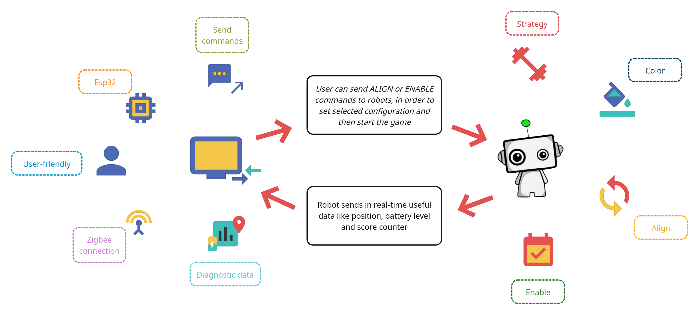
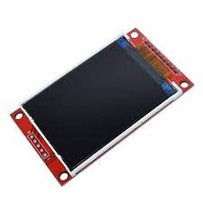
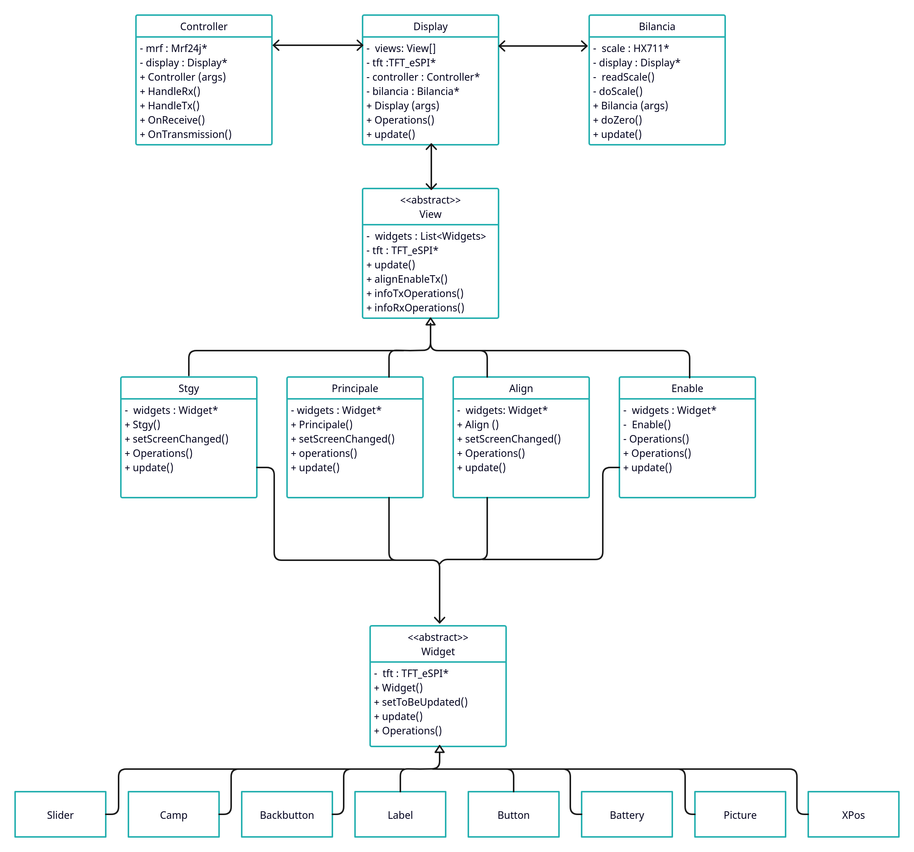

# UI library for TFT display


# Introduction

This simple C++ UI library for microcontrollers comes from a previous project developed within **ARSLAB** (Autonomous and Robotic Systems Laboratory) in University of Catania where I needed to provide a friendly user interface for our team for controlling two robots in real-time, sending them well-designed commands and receive diagnostic data from them.



# Hardware 

The components used for the project are:

- An **Esp32-VRoom-32** board, used for flashing firmware and to link all the other components
- A touchscreen **TFT** (Thin Film Transistor) **display** used for User Interface

but we can easily change settings for other MCUs and TFT displays.

> Warning: using a TFT display is mandatory for the correct working of the firmware, since this library has been designed starting from TFT_eSPI library  for C++

## Esp32-VRoom-32

This board is equipped with WI-FI, Bluetooth and BLE modules, targeting a wide range of applications. At the core of this module is the ESP32-D0WDQ6 chip, designed to be adaptive and scalable. There are two CPU cores that can be individually controlled, and the CPU clock frequency is adjustable
from 80 MHz to 240 MHz. The chip also has a low-power coprocessor that can be used instead of the CPU to save power while performing tasks that do not require much computing power, such as monitoring of peripherals. ESP32 integrates a rich set of peripherals, ranging from capacitive touch sensors, SD card interface, Ethernet, high-speed SPI, UART, I2S, and I2C.

> from ESP32-VROOM-32 datasheet
> Espressif Systems
> Copyright © 2023


#### Features

- Two low-power Xtensa® 32-bit LX6 microprocessors
- ESP32-D0WD core
- Supports multiple external QSPI Flash and SRAM chips
- 32Mbits 3.3V SPI flash
- 40MHz crystal

- Onboard PCB antenna for ESP32-WROOM-32D
- U.FL connector (which needs to be connected to an external IPEX antenna) for ESP32-SS or CS is the Chip Select, used to select the slave device wanted to be used
- WROOM-32U
- Advanced power-management technologies

#### Specifications

- 802.11 b/g/n (802.11n up to 150Mbps) Wi-Fi protocol
- BLUETOOTH® v4.2 BR/EDR and BLE
- SD card, UART, SPI, SDIO, I2C, LED PWM, Motor PWM, I2S, and IR module interfaces

- Hall sensor
- 2.7V to 3.6V operating voltage supply
- 80mA average operating current
- -40°C to 85°C operating temperature range


## ILI9341 TFT SPI display

The display has a resolution of 320x240 with dimension of the screen of 2,8". It has a resistive touchscreen and uses SPI peripherals to connect to MCUs.

> TFT (Thin Film Transistor) is a technology applied to LCD (Liquid Crystal Display) or OLED (Organic Light Emitting Diode) displays.

#### Features

-  2.8-inch color screen,support 65K color display,display rich colors
-  320X240 resolution, optional touch function
-  Using the SPI serial bus, it only takes a few IOs to illuminate the display
-  Easy to expand the experiment with SD card slot
-  Provide a rich sample program
-  Military-grade process standards, long-term stable work
-  Provide underlying driver technical support




# Software


#### UML Class Diagram



This is the UML class diagram proposed for the ARSLAB project.

As seen it is possible to create more than one view, make them interact and all of it is encapsulated and handled within Display. 


## Display, Views and Widgets

- `Display` is the main class within the project and manages the interaction between the views, the controller and the scale:

- `View` is an abstract class that set the basic attributes and methods for a concrete view and keep static data coming from controller and scale, that will be inherited and used by concrete classes.

- `Widget` is an abstract class that set basic basic attributes and methods for concrete widgets, useful "object adapters" of TFT_eSPI.

Here is an example of call invoking fall from `loop()` in `main.cpp` to the generic widget in the current view:

#### UML Sequence diagram of update methods

#### 

- in `main.cpp`

```c++
void loop()
{
    display->update();
}
```

- in `Display`

```c++
void Display::update()
{
    views[current_view]->update();
}
```

- in `View`

```c++
void View::update(){
    for (int i = 0; i < this->widgets.size(); i++) {
        this->widgets[i]->update();
    }
}
```

- in `Label` (inherited from Widget)

```c++
    void update(){
        Widget::update();
        if (!visible) {
            return;
        }
        if (toBeUpdated) {
            drawLabel();
        }
    }
```


# Authors

- Giovanni Campo

co-authored by:

- Federico Fausto Santoro, PhD
- Stefano Borzì
- Corrado Santoro, PhD
- Marco Pometti